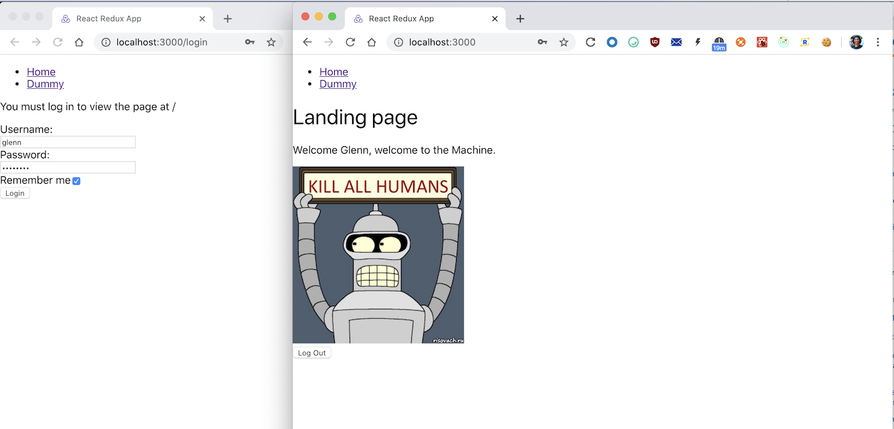
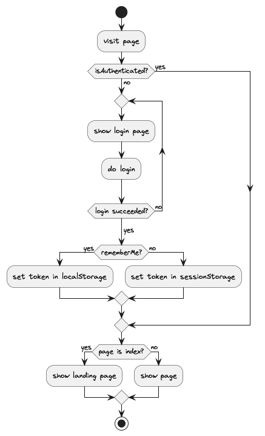

# redux-toolkit-login-flow

A potentially reusable formalized login flow pattern for crafting web development project.

### Why?

Contrary to popular belief, never in my career as a Software Engineer that I build login/signin/auth page myself (I've always been working on projects where the auth flow is already provided or where login is not required 😋). So on this one long weekend during [self-quarantine period of the outbreak in 2020](https://en.wikipedia.org/wiki/2019%E2%80%9320_coronavirus_pandemic), finally I've got some spare time to implement my take on it, while doing some transcendental explorations on React, React Router, and Redux Toolkit.

This project was bootstrapped with [Create React App](https://github.com/facebook/create-react-app), using the [Redux](https://redux.js.org/) and [Redux Toolkit](https://redux-toolkit.js.org/) template.



As you might have seen, this app is built with a very bare minimum, if not none, of CSS. **This is intentional.** HTML and JavaScript can render pretty minimalist, can't they? 😈

### The flow

I tried to formalize the flow back in the last quarter of 2019 and realised it using this very cool project called [PlantUML](https://plantuml.com/). So this is what I think that works for me in 80% of the cases:



The PlantUML source code is available [here](artifacts/login-flow.puml) in the artifacts directory.

## Spinning up the development server

```bash
$ pnpm start
```

You can find other runnable scripts in [package.json](package.json).

## Author

Glenn Dwiyatcita ([@dwiyatci](http://tiny.cc/dwiyatci))

## License

WTFPL – Do What the Fuck You Want to Public License.

See [LICENSE.txt](LICENSE.txt).


